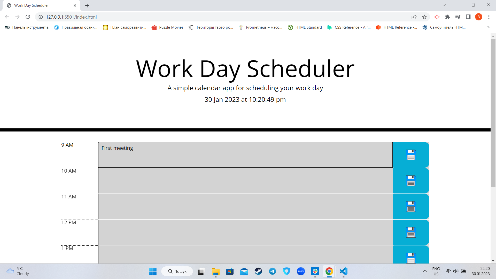

# Work-Day-Scheduler

## Description
This is a simple calendar application that allows a user to save events for each hour of the day by modifying starter code.
The app does:

Display the current day at the top of the calender when a user opens the planner;

Present timeblocks for standard business hours when the user scrolls down;

Color each timeblock based on past, present, and future when the timeblock is viewed;

Allow a user to enter an event when they click a timeblock;

Save the event in local storage when the save button is clicked in that timeblock;

Persist events between refreshes of a page;

Refresh local storage in the end of a day.

## Installation

N/A

## Usage

In order to see the planner follow the link. In order to save a task click on hour line and tape your plan. To save a task click button with disquette image.
https://hllmtrxwrld.github.io/Work-Day-Scheduler/

## Credits

N/A

## License

N/A